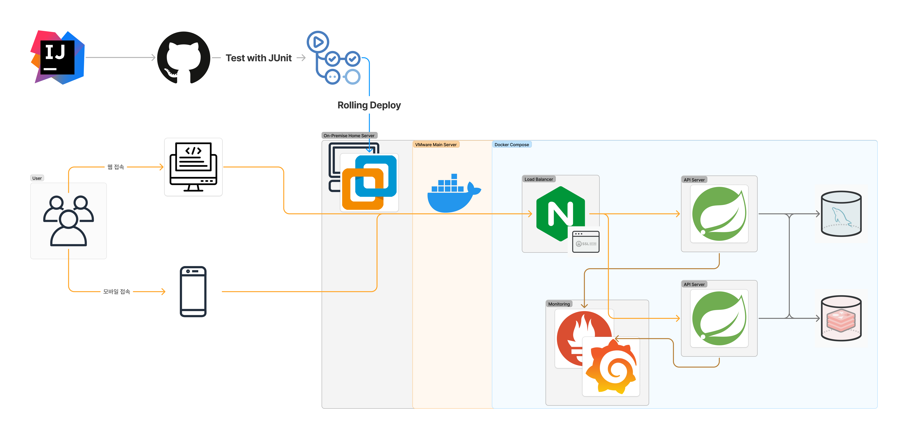
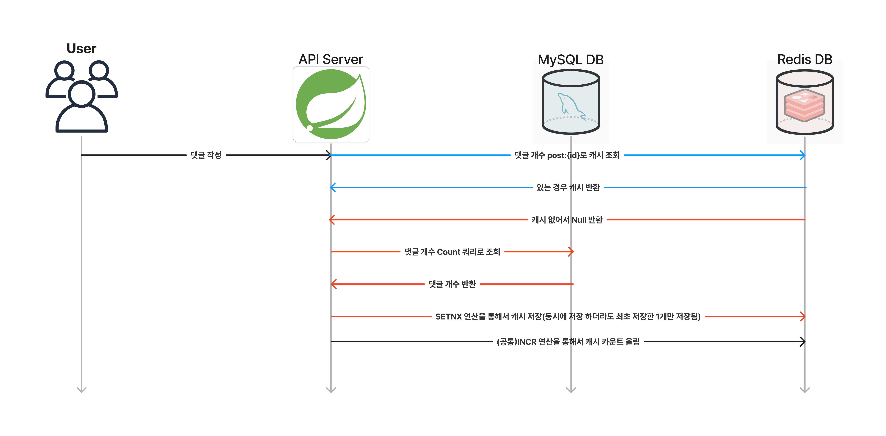
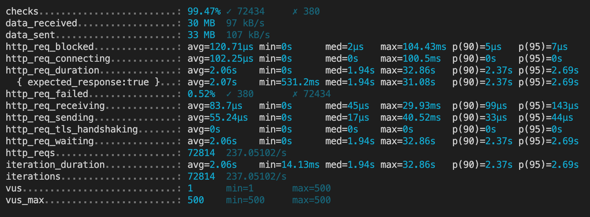
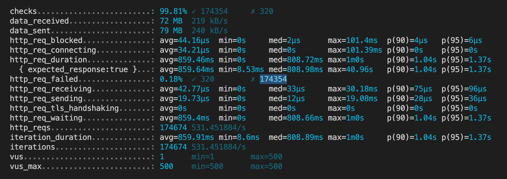
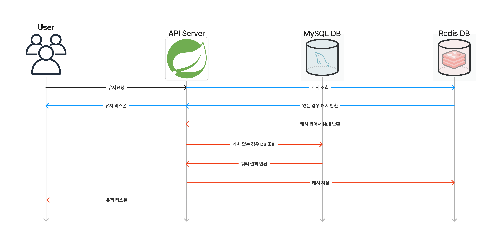
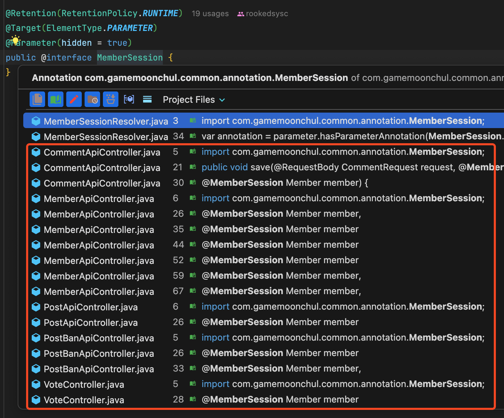
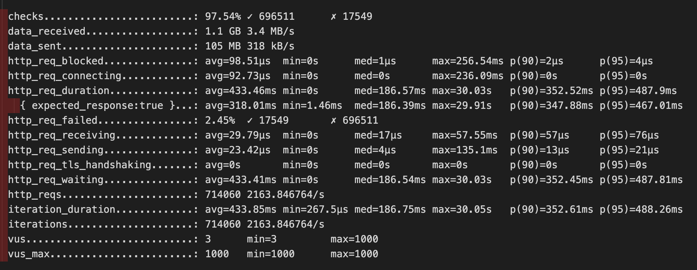
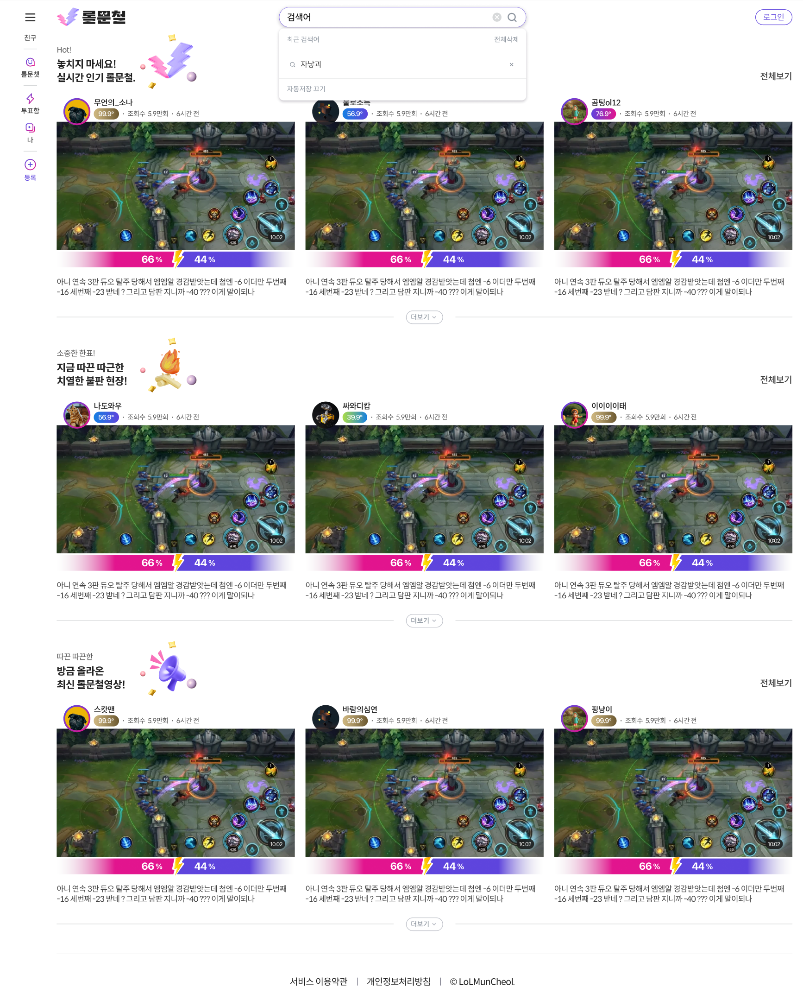
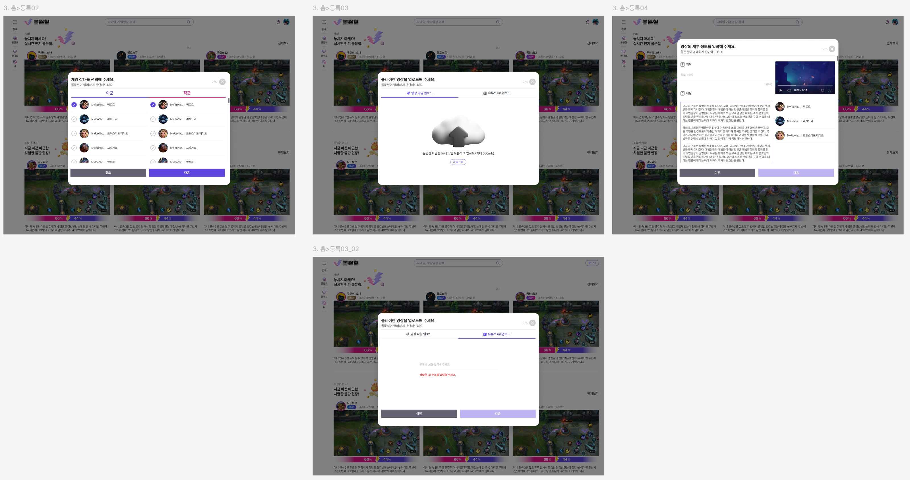
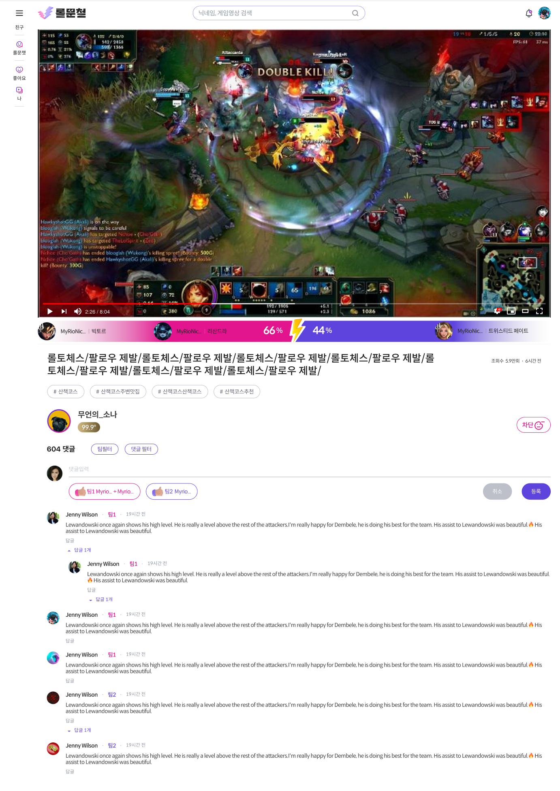

## 💁‍♂️ Introduce 

한문철 변호사님의 유튜브를 모티브로 하여 **게임 유저들간의 분쟁 조정을 위한 SNS 서비스** 입니다.

## 🏢 Architecture



## 💼 Portfolio 

### ⚡️ Optimization

#### [성능개선] Redis를 활용한 댓글 개수 동시성 문제 해결

- UML



- 문제
  - **댓글 수를 반정규화하여 저장하면서 동시성 문제가 발생**
    - 여러 사용자가 동시에 댓글을 작성할 경우, 게시물의 댓글 수를 증가시키는 과정에서 데이터 불일치 가능성 발생.
    - 안정적이고 성능 좋은 동시성 제어 방법이 필요.

- 해결과정
1. **비관적 락(Pessimistic Lock)**
   - 초기에는 비관적 락을 적용하여 데이터베이스에 Exclusive Lock을 걸어 동시성을 제어.
   - **이 방식의 한계**:
     - 트랜잭션이 종료될 때까지 다른 트랜잭션이 대기해야 하므로 성능 저하 발생.
     - 락 획득 과정에서 오버헤드가 발생하고, 다수의 트랜잭션이 락을 요청하면 세션 유지로 TPS가 낮아짐.
   - **낙관적 락으로 전환 이유**:
     - 각 게시물별로 락이 걸리기 때문에, 게시물에 대해 동시에 접속해 댓글을 작성할 확률이 낮다고 판단.
     - 동시 접근 가능성이 낮은 경우, 락을 최소화하는 낙관적 락이 더 효율적이라고 예상.

2. **낙관적 락(Optimistic Lock)**
   - 낙관적 락을 적용하여 `version` 필드를 활용한 데이터 변경 검증 방식으로 전환.
   - **이 방식의 한계**:
     - 예상과 달리 동시 접속자가 많아지면서 충돌이 발생했고, 이를 해결하기 위해 Retry 로직을 도입.
     - Retry 로직에 랜덤 대기 시간을 적용한 결과, 실패율이 22% → 3%로 개선되었으나, 트래픽이 더 증가할 경우 성능 저하가 우려됨.
   - **Redis로 전환 이유**:
     - 데이터베이스에 과도한 부하를 줄이기 위해 별도의 동시성 제어 방법 필요.
     - Redis를 활용하면 트래픽 증가에도 성능을 안정적으로 유지할 수 있을 것으로 판단.

3. **Redis를 활용한 해결**
   - Redis의 `SETNX` 명령어로 댓글 수를 초기화하고 `INCR` 명령어로 증가시키는 방식을 도입.
   - 동시성 제어를 데이터베이스가 아닌 Redis에서 처리하여, 데이터베이스 락에 의한 성능 저하 문제를 근본적으로 해결.
- 결과
  - **최종 선택**
    - Redis를 활용한 동시성 제어 방식 채택.
    - 동시성 문제를 해결하고 트래픽 증가에도 안정적인 성능을 유지.
  - **성능 개선 효과**
    - Optimistic Lock에서 Redis로 전환한 결과, TPS는 241 → 581로 **약 141% 향상**.
    - 응답 속도는 2초에서 859ms로 **약 57% 개선**.
    - Redis의 빠른 처리 속도를 통해 고성능 동시성 제어를 달성.

<details>
<summary>성능 측정 상세 결과</summary>

- 테스트 조건 : 5분간 500명의 가상 유저가 동시에 하나의 게시물에 대해서 댓글 작성.
- 낙관적락 사용하는 경우



- Redis를 사용하는 경우 



</details>


#### [성능개선] 쿼리 분석과 캐싱 적용을 통한 메인 페이지 조회 성능 개선

- UML



- 문제
  - **게시물 조회 시 성능 저하 발생**
    - Redis를 사용하지 않고 데이터베이스 쿼리만으로 성능 테스트를 진행한 결과, 심각한 성능 문제가 발생.
    - 테스트 결과:
      - **TPS**: 48
      - **평균 응답시간**: 15.5초
    - 주요 원인: 데이터베이스 쿼리의 비효율성과 인덱스 미사용.
- 해결과정
1. **쿼리 튜닝**
   - 문제 원인 분석:
     - 대부분의 `JOIN` 쿼리가 데이터베이스 인덱스를 활용하지 못함.
   - 해결 방법:
     - `JOIN` 및 필터링에 사용되는 컬럼에 인덱스를 추가.
   - 성능 개선 결과:
     - **TPS**: 1895
     - **평균 응답시간**: 530ms
     - 주요 쿼리 개선:
       - 1번 쿼리: 294ms → 125ms
       - 3번 쿼리: 143ms → 71ms
       - 4번 쿼리: 142ms → 87ms

2. **불필요한 Lazy Loading 문제 해결**
   - 문제 원인 분석:
     - `MatchUser`와 `MatchGame` 간의 불필요한 연관 관계로 인해 Lazy Loading이 동작하지 않음.
     - 불필요한 `MatchGame` 조회 쿼리가 지속적으로 발생.
   - 해결 방법:
     - `MatchUser`와 `MatchGame` 간의 연관 관계를 제거.
   - 성능 개선 결과:
     - **TPS**: 2321
     - **평균 응답시간**: 433ms

3. **Redis 캐싱 도입**
   - 목적:
     - 데이터베이스 부하를 줄이고 성능을 최적화.
   - 성능 개선 결과:
     - **TPS**: 3390
     - **평균 응답시간**: 298ms

- 결과
  - 데이터베이스 쿼리 성능 최적화와 Redis 캐싱 도입을 통해 TPS와 평균 응답시간 모두 크게 개선.
  - **TPS**: 48 → 3390 (TPS **6962.5% 증가**)
  - **평균 응답시간**: 15.5초 → 298ms (**98% 감소**)

#### [코드 공통화] AOP를 이용한 유저 인증 정보 로직 공통화 

- 원인
  - JWT Token에서 User의 정보를 꺼내오는 로직 중복 발생.

```java
    @PostMapping
    public void saveComment(@RequestBody CommentRequest request, HttpServletRequest httpServletRequest) {
        // 토큰 추출 및 검증
        String token = httpServletRequest.getHeader("Authorization");
        if (token == null || token.isEmpty()) {
            throw new UnauthorizedException("Authorization token is missing");
        }

        // 토큰에서 정보 추출
        TokenInfo tokenInfo = extractTokenInfo(token);

        // 멤버 조회
        Member member = memberRepository.findById(tokenInfo.id())
            .orElseThrow(() -> new BadRequestException("Member not found"));

        // 비즈니스 로직 호출
        CommentSaveRequest saveDto = new CommentSaveRequest(null, request.content(), request.postId());
        commentService.save(saveDto, member);
    }
```

- 해결과정 

1. Spring AOP를 이용해서 유저 정보를 가져오는 Annotation을 만들어서 공통화.
2. MemberSession Annotation & Resolver 생성

```java
@Retention(RetentionPolicy.RUNTIME)
@Target(ElementType.PARAMETER)
@Parameter(hidden = true)
public @interface MemberSession {
}
```

<details> 
<summary>MemberSessionResolver 상세 보기</summary>

```java
@Component
@RequiredArgsConstructor
public class MemberSessionResolver implements HandlerMethodArgumentResolver {
    private final MemberRepository memberRepository;

    @Override
    // 여기서 True로 return이 되면 resolveArgument가 실행됨
    public boolean supportsParameter(MethodParameter parameter) {
        // 지원하는 파라미터 체크, 어노테이션 체크하는 영역
        // 1. 어노테이션이 있는지 체크
        var annotation = parameter.hasParameterAnnotation(MemberSession.class);
        // 2. parameter type 체크
        boolean parameterType = parameter.getParameterType()
            .equals(Member.class);

        return annotation && parameterType;
    }

    @Override
    @Nullable
    public Object resolveArgument(MethodParameter parameter, @Nullable ModelAndViewContainer mavContainer,
                                  NativeWebRequest webRequest, @Nullable WebDataBinderFactory binderFactory) throws Exception {
        return getTokenInfo()
            .map(this::findMember)
            .orElse(null);
    }

    private Optional<TokenInfo> getTokenInfo() {
        return Optional.ofNullable(RequestContextHolder.getRequestAttributes())
            .map(attributes -> (TokenInfo) attributes.getAttribute("tokenInfo", RequestAttributes.SCOPE_REQUEST));
    }

    private Member findMember(TokenInfo tokenInfo) {
        return memberRepository.findById(
                tokenInfo.id())
            .orElseThrow(() -> {
                return new BadRequestException(MemberStatus.MEMBER_NOT_FOUND);
            });
    }
}
```

</details>

3. Controller에 적용 

```java
    @PostMapping
    public PostDetailResponse upload(
        @Valid
        @RequestBody PostUploadRequest request,
        @MemberSession Member member
    ) {
        PostDetailResponse response = postService.upload(request, member);
        return response;
    }
```

- 결과 
  - 5개의 클래스, 17개의 메서드에서 로직 공통화
  - 

### ☠️ Challenging Implementation

#### [구현] Spring Security에서 발생하는 에러 Customizing 

- 문제
  - **Spring Security에서 발생하는 예외가 RestControllerAdvice에서 처리되지 않는 문제**
    - 원인:
      - Spring Security의 SecurityFilter가 **ServletFilterChain**에서 동작하여, **Spring MVC의 Exception Handling 메커니즘보다 먼저 실행됨**.
    - 상황:
      - JWT 인증 과정에서 다양한 예외 상황(만료된 토큰, 잘못된 시그니처, 권한 부족 등)에 대한 적절한 에러 메시지, 에러 코드 반환 필요.
- 해결과정
1. **문제 원인 분석 및 초기 시도**
   - 다양한 자료를 참고하여 AuthenticationEntryPoint와 Custom AuthenticationException을 정의해 예외 처리 방식을 적용.
   - [당시 참고했던 사이트](https://stackoverflow.com/questions/19767267/handle-spring-security-authentication-exceptions-with-exceptionhandler)
   - 디버깅 과정:
     - Custom AuthenticationException이 **AuthenticationEntryPoint**에서 정상적으로 처리되지 않음.
     - 장시간 디버깅을 통해도 원인 파악이 어려움.
   - 초기 시도가 실패함에 따라 다른 대안을 모색.
2. **CustomEntry를 이용한 예외 처리 방식 구현**
   - **HttpServletRequest Attributes**를 활용:
     - 예외 발생 시 커스텀 상태 코드를 `HttpServletRequest`의 Attributes에 저장.
   - **CustomEntry로 예외 처리**:
     - EntryPoint에서 `HttpServletRequest`의 Attributes 값을 추출.
     - 추출한 상태 코드를 Enum으로 변환.
     - **Response Writer**를 사용해 ObjectMapping 방식으로 JSON 응답 처리.
   - 최종적으로 원하는 예외 상황에 맞는 적절한 JSON 응답을 반환할 수 있도록 구현.
- 결과
  - **Spring Security에서 발생하는 예외를 Security의 EntryPoint에서 Customize 하는데 성공**.
    - 예외 상황(만료된 토큰, 잘못된 시그니처, 권한 부족 등)에 대해 적절한 HTTP 응답 코드와 JSON 메시지를 반환.
  - **Spring Security와 Spring MVC 간의 Exception Handling 차이를 이해하고 적절한 해결책을 적용**.

#### [구현] 리소스가 적은 OAuth Client Apple Login 구현 

- 문제
  - **App Store 정책에 따른 Apple 로그인 구현 요구**
    - 외부 OAuth를 사용할 경우 Apple로 로그인을 함께 구현해야 한다는 요구사항.
    - (현재는 정책이 변경되어 필수 구현 사항이 아님.)
  - **문서 부족**
    - OAuth Client 공식 문서와 Apple Developer 공식 문서에는 OAuth Client를 활용한 Apple 로그인 구현에 대한 자료가 부족.

- 해결과정
1. **Github 자료 분석**
   - Apple 로그인 구현 사례를 찾기 위해 Github에서 OAuth Client를 활용한 프로젝트를 분석.
   - Apple 인증 방식이 OAuth가 아닌 **OIDC(OpenID Connect)** 방식으로 동작한다는 점을 확인.

2. **OAuth와 OIDC의 차이점 학습 및 OIDC 구현**
   - OAuth와 OIDC의 차이점 분석:
     - OIDC는 OAuth를 확장하여 사용자 인증을 포함한 프로토콜임.
     - OAuth Client에서는 별도의 Interface를 사용해야 OIDC를 지원할 수 있음.
   - OAuth Client를 활용해 OIDC 방식으로 Apple 로그인을 구현.

- 결과
  - **Apple 로그인 구현 성공**
    - OAuth Client와 OIDC를 조합해 Apple 로그인을 구현.
  - **기술적 성장**
    - OAuth와 OIDC의 차이점을 깊이 이해하고, OAuth Client를 활용한 OIDC 구현 방법을 습득.
    - 제한된 문서 환경에서 자료를 분석하고 문제를 해결하는 경험을 통해 기술적으로 성장.

### 🛠️ ErrorFix

#### [수정] OneToOne Lazy Loading 오류 해결 (불필요 쿼리 삭제)

<details>
<summary>상세보기</summary>

- 문제
  - **OneToOne 연관관계 Lazy Loading 문제**: 
    - `MatchUser` 엔티티에서 `MatchGame`과 `ManyToOne` 관계로 매핑되어 있음.
    - `VoteOptions`가 `MatchUser`와 `OneToOne`으로 매핑되어 있으며, `MatchGame`은 `ManyToOne`으로 연관되어 있음.
    - Hibernate에서 연관관계의 주인이 아닌 곳에서는 **Lazy Loading이 동작하지 않을 가능성**이 있음.
  - 이로 인해 `MatchGame` 데이터를 사용하는 곳이 없음에도 **불필요한 쿼리**가 실행됨.
- 해결과정
1. **문제 상황 재현**:
   - `Post -> VoteOptions -> MatchUser -> MatchGame`으로 이어지는 관계에서 쿼리가 과도하게 실행됨을 확인.
   - 디버깅 중 `MatchGame` 관련 데이터 조회가 발생하지만 실제로 데이터가 사용되지 않음.
2. **디버깅 시도**:
   - `Getter`와 `Constructor`를 직접 정의하고, 해당 메서드에 브레이크포인트 설정.
   - 하지만 Stack Trace를 타고 올라가도 **`createQuery` 호출 조건**을 특정할 수 없었음.
   - 원인을 정확히 추적하지 못했지만, `Lazy Loading`과 관련된 문제로 추정.
3. **문제의 본질 파악**:
   - OneToOne 연관관계에서 주인이 아닌 곳에서는 Lazy Loading이 동작하지 않을 수 있다는 Hibernate 문서를 참조.
   - `MatchUser`에서 `MatchGame`의 불필요한 연관관계로 인해 데이터 조회가 발생한 것으로 결론.
- 결과
  - **해결책**:
    - `MatchUser`와 `MatchGame` 간의 **연관관계를 제거**.
    - 이를 통해 `MatchGame`에 대한 불필요한 쿼리 실행 방지.

  - **쿼리 변화**:
    - 기존에 실행되던 쿼리:
      ```sql
      select mu1_0.game_id, mu1_0.id, mu1_0.champion_name, mu1_0.nickname, mu1_0.puuid, mu1_0.win
      from match_user mu1_0
      where mu1_0.game_id = 'KR_7356095596';
      ```
    - 해결 후 불필요한 쿼리가 더 이상 실행되지 않음.

  - **성능 개선**:
    - 해결 전:
      - **TPS**: 1895
      - **응답 속도**: 530ms
    - 해결 후:
      - **TPS**: 2321
      - **응답 속도**: 433ms
    - **개선 결과**:
      - TPS: **426 증가** (약 22.5% 개선)
      - 응답 속도: **97ms 감소** (약 18.3% 개선)
    - 

</details>

## 🎨 Design

<details>
<summary>상세보기</summary>

- 메인 화면 



- 회원가입 화면 


- 게시물 업로드 화면



- 게시물 상세 화면


  
</details>

## 📚 로컬에서 실행하는 방법

- root 폴더에 .env 생성 아래 **YOUR_로 시작하는 항목들을 전부 적절한 값으로 대체**하시기 바랍니다.

```console
JWT_SECRET=YOUR_JWT_SECRET
S3_BUCKET=YOUR_S3_BUCKET
S3_ACCESS_KEY=YOUR_S3_ACCESS_KEY
S3_SECRET_KEY=YOUR_S3_SECRET_KEY
S3_REGION=YOUR_S3_REGION
RIOT_API=YOUR_RIOT_API
GOOGLE_CLIENT_ID=YOUR_GOOGLE_CLIENT_ID
GOOGLE_CLIENT_SECRET=YOUR_GOOGLE_CLIENT_SECRET
APPLE_CLIENT_ID=YOUR_APPLE_CLIENT_ID
APPLE_KEY_ID=YOUR_APPLE_KEY_ID
APPLE_TEAM_ID=YOUR_APPLE_TEAM_ID
APPLE_PRIVATE_KEY=YOUR_APPLE_PRIVATE_KEY
DB_URL=jdbc:mysql://gm-db:3306/gamemuncheol?userSSL=false&useUnicode=true&allowPublicKeyRetrieval=true
DB_USERNAME=root
DB_PASSWORD=df159357
BASE_URL=YOUR_BASE_URL
REDIS_HOST=gm-redis
REDIS_PORT=6379
REDIS_PW=df159357
```

- 스크립트 실행

```console
bash local_deploy.sh
```

## 🚨 주요 이슈

- [디테일 화면 Redis Cache Aside Pattern 적용](https://github.com/gamemuncheol/gamemuncheol-api/issues/155)
- [낙관락 vs 비관락 성능 비교](https://github.com/gamemuncheol/gamemuncheol-api/issues/192)
- [Spring Server DB CP, Thread Pool 등 최적화](https://github.com/gamemuncheol/gamemuncheol-api/issues/180)
- [JWT 토큰 외부로 노출되면 안되는 정보 은닉 및 JWT Filter에서 사용자 정보 로드 방식 개선](https://github.com/gamemuncheol/gamemuncheol-api/issues/167)
